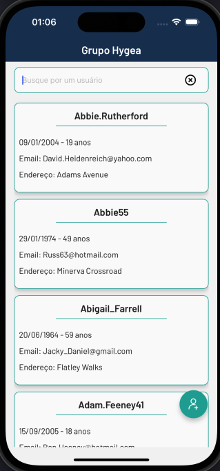
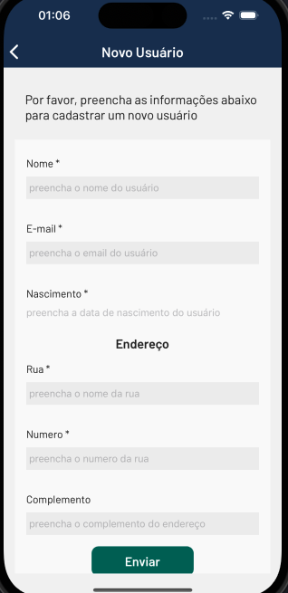
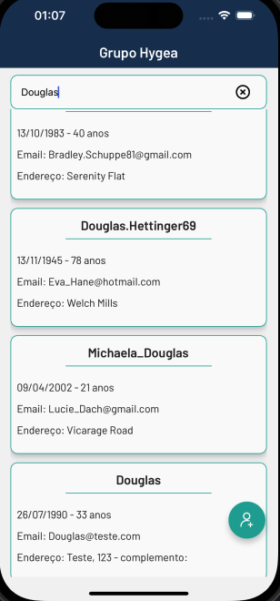
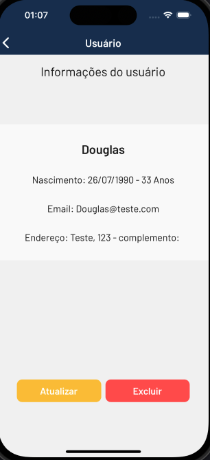
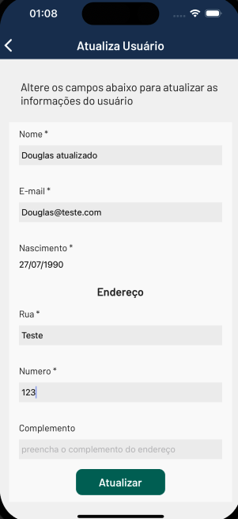
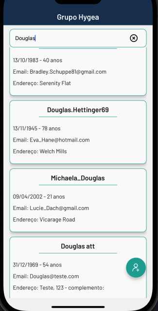
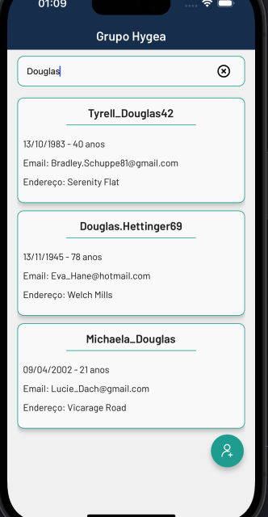

# Teste CRUD

Teste CRUD usuários.

## Instalação

Instale com yarn

```bash
  yarn install
  yarn start
```

## Autores

- [@Douglas](https://www.github.com/dougb60)

## Screenshots










## Wireframe

- [Excalidraw](https://excalidraw.com/#json=lXEj7z0j4ItrjBV68vSWS,N-brv8HwyfIUxBoufZjdpw)
